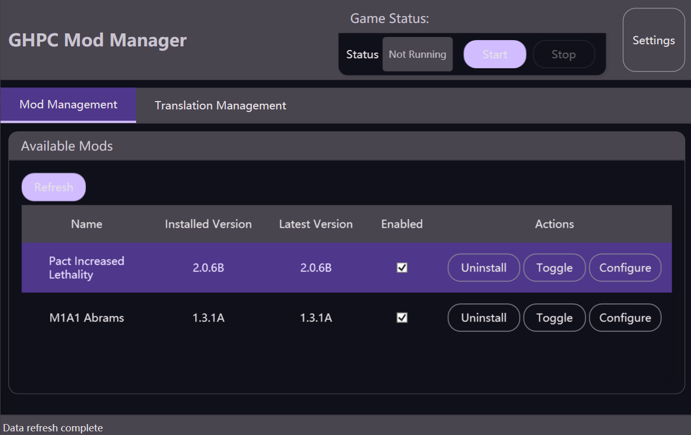
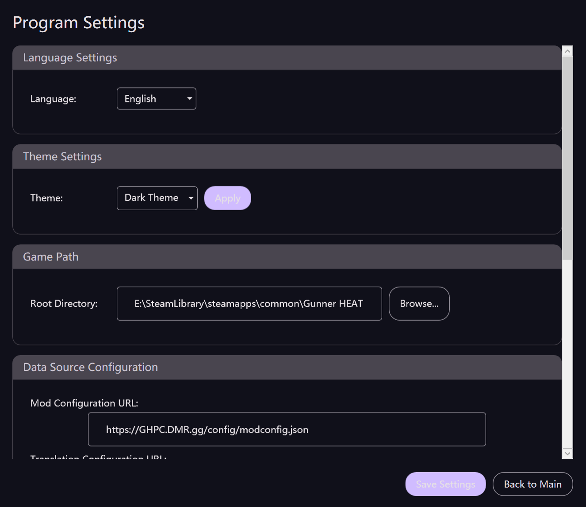

# GHPC Mod Manager

[](https://github.com/RoyZ-iwnl/GHPC-Mod-Manager/releases)
[](https://github.com/RoyZ-iwnl/GHPC-Mod-Manager/actions)
[](LICENSE)
[](https://github.com/RoyZ-iwnl/GHPC-Mod-Manager/releases)

[中文文档](README.zh-CN.md) | **English**

A comprehensive mod management tool for GHPC (Gunner, HEAT, PC!) with built-in translation system support and MelonLoader integration.

## 📸 Screenshots


*Main mod management interface*


*Settings and configuration*


*Built-in translation management*

## ✨ Features

### 🎮 Mod Management
- **One-Click Installation**: Install mods directly from GitHub releases
- **Multi-threaded Downloads**: Fast mod downloads with concurrent download support
- **Version Control**: Track installed and latest versions
- **Enable/Disable Mods**: Toggle mods without uninstalling
- **Configuration Support**: Edit mod configurations through intuitive UI
- **Script Mod Support**: Handle script-based installations with security warnings
- **Manual Mod Detection**: Automatically detect manually installed mods

### 🌍 Translation System
- **Integrated Translation**: Built-in XUnityAutoTranslator support
- **Multi-Language Support**: Switch between different translation languages
- **Auto-Update**: Keep translation files up to date

### 🔧 MelonLoader Integration
- **Auto-Detection**: Automatically detect existing MelonLoader installations
- **One-Click Setup**: Install MelonLoader with a single click
- **Version Management**: Support for different MelonLoader versions

### 🎨 User Experience
- **Modern UI**: Material Design 3 inspired interface
- **Multi-Language Interface**: Full support for English and Chinese
- **Dark/Light Theme**: Customizable appearance
- **Game Process Monitor**: Disable mod operations when game is running
- **Progress Tracking**: Real-time download and installation progress

## 🚀 Quick Start

### System Requirements
- Windows 10/11 (x64)
- .NET 8.0 Runtime (automatically installed if missing)
- Administrator privileges (required for mod installation)
- GHPC game installed

### Installation
1. Download the latest release from [Releases](https://github.com/RoyZ-iwnl/GHPC-Mod-Manager/releases)
2. Extract `GHPC-Mod-Manager-v{version}.zip` to your preferred location
3. Run `GHPC Mod Manager.exe` as Administrator
4. Follow the setup wizard on first launch:
   - Select your preferred language
   - Locate your GHPC installation directory
   - Configure MelonLoader (if not already installed)

### First Time Setup
1. **Language Selection**: Choose between English and Chinese
2. **Game Directory**: Browse and select your GHPC installation folder
3. **MelonLoader Setup**: Install MelonLoader if not already present

## 📋 Supported Mods

To view currently supported mods and request support for new mods, visit: [GHPC-Mod-Manager-Web](https://github.com/RoyZ-iwnl/GHPC-Mod-Manager-Web)

## 📖 Usage

### Managing Mods
1. **Browse Available Mods**: View all supported mods with version information
2. **Install Mods**: Click "Install" to download and install mods automatically
3. **Enable/Disable**: Use the checkbox to toggle mods without uninstalling
4. **Configure Mods**: Click "Configure" for mods that support custom settings
5. **Update Mods**: Install newer versions when available

### Translation System
1. **Install Translation**: Go to Translation Management tab
2. **Select Language**: Choose your preferred translation language
3. **Update Files**: Keep translation databases up to date
4. **Toggle Translation**: Enable/disable the translation plugin

### Settings
- **Game Path**: Change GHPC installation directory
- **Data Sources**: Configure mod and translation repository URLs
- **Theme**: Switch between light and dark themes
- **Language**: Change interface language
- **Maintenance**: Clean temporary files and view logs

## 🌐 Localization

### Adding New Languages

The project uses .NET resource files (.resx) for internationalization. To add a new language:

1. **Create Resource Files**:
   ```
   Resources/Strings.{culture}.resx  (e.g., Strings.es-ES.resx for Spanish)
   ```

2. **Copy Base Strings**: Start with `Strings.resx` as template and translate values

3. **Generate Designer File**:
   ```bash
   # Using ResGen.exe from Windows SDK
   powershell.exe -Command "& 'C:\Program Files (x86)\Microsoft SDKs\Windows\v10.0A\bin\NETFX 4.8 Tools\ResGen.exe' Resources\Strings.es-ES.resx Resources\Strings.es-ES.resources /str:cs,GHPC_Mod_Manager.Resources,Strings,Resources\Strings.es-ES.Designer.cs /publicclass"
   ```

4. **Update Language List**: Add new culture to `AvailableLanguages` in `SettingsViewModel.cs`

5. **Test Language**: Change system culture or add UI language switcher

### Current Supported Languages
- **English (en-US)**: Default language
- **简体中文 (zh-CN)**: Simplified Chinese

### Translation Guidelines
- Keep UI text concise and user-friendly
- Maintain consistent terminology across the application
- Test translations with different text lengths to ensure UI compatibility
- Use appropriate cultural conventions (date formats, number formats, etc.)

## 🔧 Development

### Prerequisites
- Visual Studio 2022 or later
- .NET 8.0 SDK
- Windows 10/11 SDK

### Building from Source
```bash
# Clone the repository
git clone https://github.com/RoyZ-iwnl/GHPC-Mod-Manager.git
cd GHPC-Mod-Manager

# Restore dependencies
dotnet restore "GHPC Mod Manager.csproj"

# Build the project
dotnet build "GHPC Mod Manager.csproj" --configuration Release

# Run the application
dotnet run "GHPC Mod Manager.csproj"
```

### Architecture
- **Framework**: .NET 8.0 WPF Application
- **Pattern**: MVVM with CommunityToolkit.Mvvm
- **DI Container**: Microsoft.Extensions.DependencyInjection
- **HTTP Client**: System.Net.Http with certificate validation
- **JSON Serialization**: Newtonsoft.Json
- **Git Operations**: LibGit2Sharp
- **Archive Handling**: System.IO.Compression

### Project Structure
```
├── Views/                 # XAML Views (UI)
├── ViewModels/            # ViewModels (UI Logic)
├── Services/              # Business Logic Services
├── Models/                # Data Models
├── Resources/             # Localization Resources (.resx)
├── Themes/                # UI Themes and Styles
├── Converters/            # Value Converters for XAML
└── app.manifest           # Administrator Privileges
```

## 📝 Version History

See [CHANGELOG.md](CHANGELOG.md) for detailed version history and release notes.

## 🤝 Contributing

We welcome contributions! 

### How to Contribute
1. Fork the repository
2. Create a feature branch (`git checkout -b feature/AmazingFeature`)
3. Commit your changes (`git commit -m 'Add AmazingFeature'`)
4. Push to the branch (`git push origin feature/AmazingFeature`)
5. Open a Pull Request

## 📄 License

This project is licensed under the MIT License - see the [LICENSE](LICENSE) file for details.

## 🙏 Acknowledgments

- [GHPC](https://gunnerheatpc.com/) - The amazing tank simulation game
- [MelonLoader](https://github.com/LavaGang/MelonLoader) - Mod loading framework
- [XUnityAutoTranslator](https://github.com/bbepis/XUnityAutoTranslator) - Translation system
- [CommunityToolkit.Mvvm](https://github.com/CommunityToolkit/dotnet) - MVVM framework
- [Material Design 3](https://m3.material.io/) - UI design inspiration

## 📞 Support

- **Issues**: [GitHub Issues](https://github.com/RoyZ-iwnl/GHPC-Mod-Manager/issues)
- **Discussions**: [GitHub Discussions](https://github.com/RoyZ-iwnl/GHPC-Mod-Manager/discussions)

## ⚠️ Disclaimer

This tool is not affiliated with the GHPC developers. Use at your own risk. Always backup your game saves before installing mods.

---

<div align="center">
  Made with ❤️ by <a href="https://space.bilibili.com/3493285595187364">DrakeX_ (AKA RoyZ)</a> and Claude Code
</div>