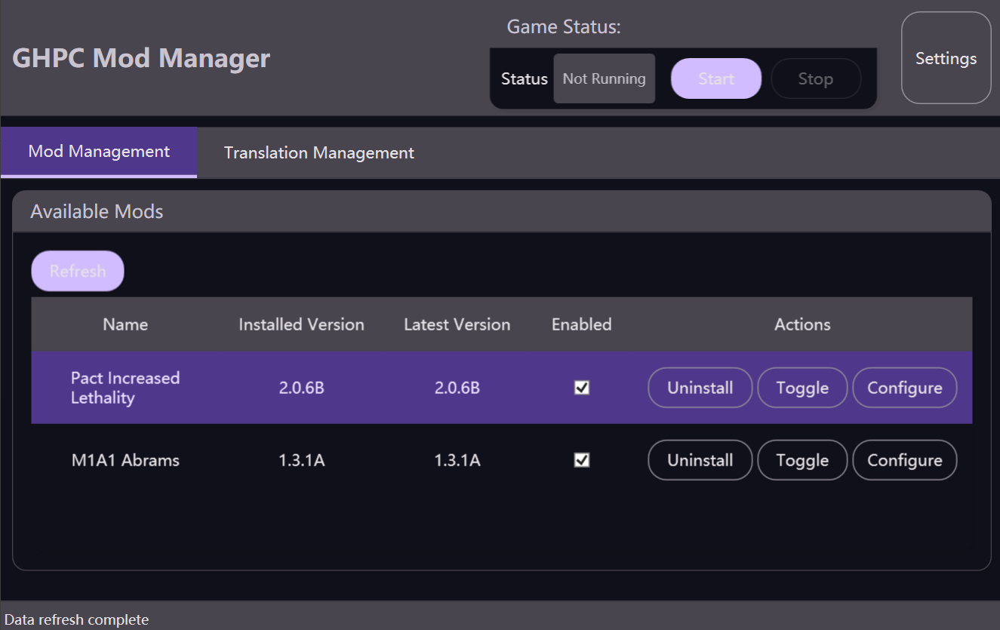
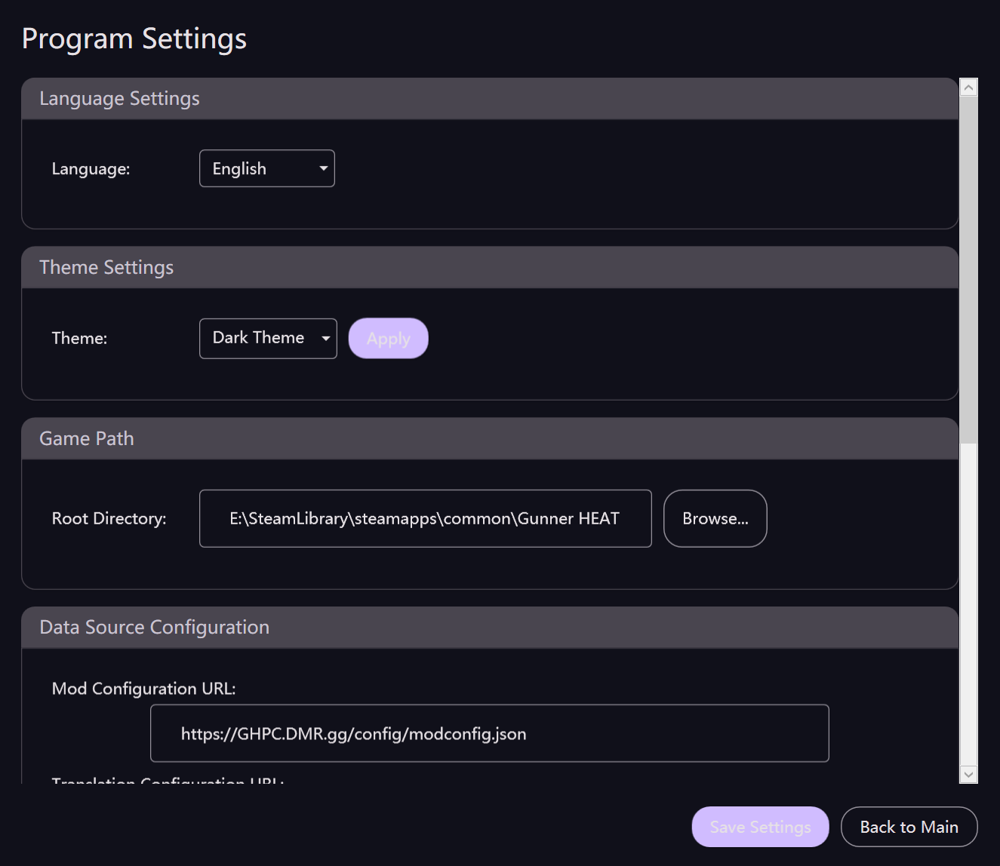
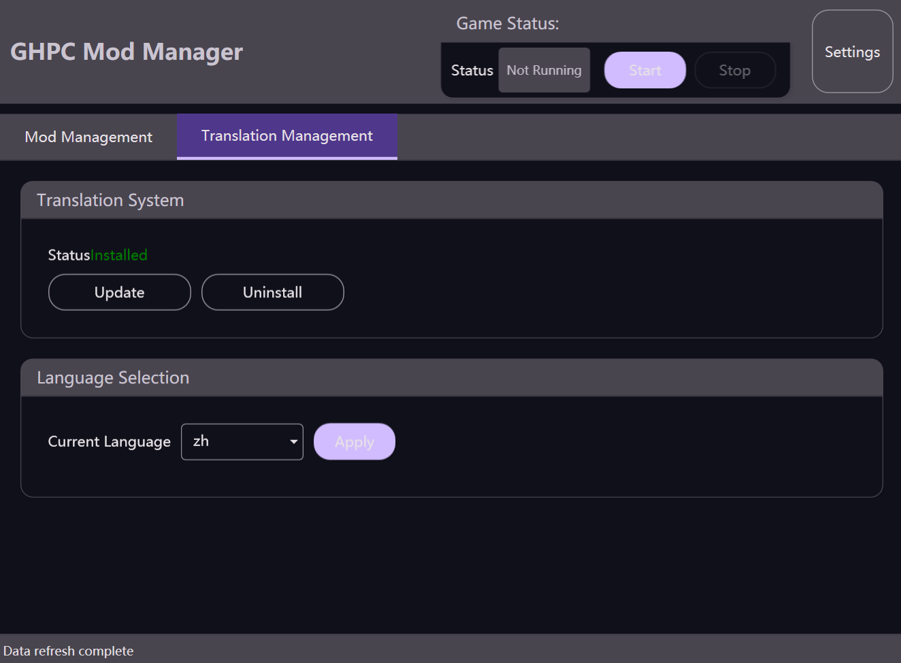

# GHPC 模组管理器

[](https://github.com/RoyZ-iwnl/GHPC-Mod-Manager/releases)
[](https://github.com/RoyZ-iwnl/GHPC-Mod-Manager/actions)
[](LICENSE)
[](https://github.com/RoyZ-iwnl/GHPC-Mod-Manager/releases)

**简体中文** | [English](README.md)

专为 GHPC (Gunner, HEAT, PC!) 设计的综合模组管理工具，内置翻译系统支持和 MelonLoader 集成。

## 📸 软件截图


*主要模组管理界面*


*设置和配置界面*


*内置翻译管理系统*

## ✨ 功能特性

### 🎮 模组管理
- **一键安装**: 直接从 GitHub 发布页安装模组
- **多线程下载**: 支持并发下载，快速获取模组文件
- **版本控制**: 跟踪已安装和最新版本
- **启用/禁用模组**: 无需卸载即可切换模组状态
- **配置支持**: 通过直观界面编辑模组配置
- **脚本模组支持**: 处理基于脚本的安装，带安全警告
- **手动模组检测**: 自动检测手动安装的模组

### 🌍 翻译系统
- **集成翻译**: 内置 XUnityAutoTranslator 支持
- **多语言支持**: 在不同翻译语言间切换
- **自动更新**: 保持翻译文件最新

### 🔧 MelonLoader 集成
- **自动检测**: 自动检测现有 MelonLoader 安装
- **一键设置**: 一键安装 MelonLoader
- **版本管理**: 支持不同 MelonLoader 版本

### 🎨 用户体验
- **现代界面**: Material Design 3 风格界面
- **多语言界面**: 完整支持中文和英文
- **深色/浅色主题**: 可自定义外观
- **游戏进程监控**: 游戏运行时禁用模组操作
- **进度跟踪**: 实时显示下载和安装进度

## 🚀 快速开始

### 系统要求
- Windows 10/11 (x64)
- .NET 8.0 运行时（缺失时会自动安装）
- 管理员权限（模组安装需要）
- 已安装 GHPC 游戏
- **网络环境**: 程序从 GitHub 下载资源，请确保网络畅通或使用 steamcommunity302 等反代工具

### 安装步骤
1. 从 [发布页面](https://github.com/RoyZ-iwnl/GHPC-Mod-Manager/releases) 下载最新版本
2. 解压 `GHPC-Mod-Manager-v{版本号}.zip` 到你选择的位置
3. 以管理员身份运行 `GHPC Mod Manager.exe`
4. 首次启动时跟随设置向导：
   - 选择你的首选语言
   - 定位你的 GHPC 安装目录
   - 配置 MelonLoader（如果尚未安装）

### 首次设置
1. **语言选择**: 在中文和英文之间选择
2. **网络检查**: 验证模组下载的网络连接
3. **游戏目录**: 浏览并选择你的 GHPC 安装文件夹
4. **MelonLoader 设置**: 如果尚未安装则安装 MelonLoader

## 📋 支持的模组

查看目前支持的模组和申请添加新模组支持，请访问：[GHPC-Mod-Manager-Web](https://github.com/RoyZ-iwnl/GHPC-Mod-Manager-Web)

## 📖 使用说明

### 管理模组
1. **浏览可用模组**: 查看所有支持的模组及版本信息
2. **安装模组**: 点击"安装"自动下载并安装模组
3. **启用/禁用**: 使用复选框切换模组状态，无需卸载
4. **配置模组**: 对支持自定义设置的模组点击"配置"
5. **更新模组**: 在有新版本可用时安装更新

### 翻译系统
1. **安装翻译**: 前往翻译管理选项卡
2. **选择语言**: 选择你喜欢的翻译语言
3. **更新文件**: 保持翻译数据库最新
4. **切换翻译**: 启用/禁用翻译插件

### 设置
- **游戏路径**: 更改 GHPC 安装目录
- **数据源**: 配置模组和翻译仓库 URL
- **主题**: 在浅色和深色主题间切换
- **语言**: 更改界面语言
- **维护**: 清理临时文件和查看日志

## 🌐 本地化

### 添加新语言

本项目使用 .NET 资源文件 (.resx) 进行国际化。要添加新语言：

1. **创建资源文件**:
   ```
   Resources/Strings.{culture}.resx  (例如: Strings.es-ES.resx 用于西班牙语)
   ```

2. **复制基础字符串**: 以 `Strings.resx` 为模板，翻译其中的值

3. **生成设计器文件**:
   ```bash
   # 使用 Windows SDK 的 ResGen.exe
   powershell.exe -Command "& 'C:\Program Files (x86)\Microsoft SDKs\Windows\v10.0A\bin\NETFX 4.8 Tools\ResGen.exe' Resources\Strings.es-ES.resx Resources\Strings.es-ES.resources /str:cs,GHPC_Mod_Manager.Resources,Strings,Resources\Strings.es-ES.Designer.cs /publicclass"
   ```

4. **更新语言列表**: 在 `SettingsViewModel.cs` 的 `AvailableLanguages` 中添加新文化

5. **测试语言**: 更改系统文化或添加界面语言切换器

### 当前支持的语言
- **English (en-US)**: 默认语言
- **简体中文 (zh-CN)**: 简体中文

### 翻译指南
- 保持界面文本简洁易懂
- 在整个应用程序中保持术语一致性
- 测试不同文本长度的翻译以确保界面兼容性
- 使用适当的文化惯例（日期格式、数字格式等）

## 🔧 开发

### 环境要求
- Visual Studio 2022 或更高版本
- .NET 8.0 SDK
- Windows 10/11 SDK

### 从源码构建
```bash
# 克隆仓库
git clone https://github.com/RoyZ-iwnl/GHPC-Mod-Manager.git
cd GHPC-Mod-Manager

# 还原依赖
dotnet restore "GHPC Mod Manager.csproj"

# 构建项目
dotnet build "GHPC Mod Manager.csproj" --configuration Release

# 运行应用程序
dotnet run "GHPC Mod Manager.csproj"
```

### 架构
- **框架**: .NET 8.0 WPF 应用程序
- **模式**: MVVM 配合 CommunityToolkit.Mvvm
- **依赖注入容器**: Microsoft.Extensions.DependencyInjection
- **HTTP 客户端**: System.Net.Http 配合证书验证
- **JSON 序列化**: Newtonsoft.Json
- **Git 操作**: LibGit2Sharp
- **压缩包处理**: System.IO.Compression

### 项目结构
```
├── Views/                 # XAML 视图 (UI)
├── ViewModels/            # 视图模型 (UI 逻辑)
├── Services/              # 业务逻辑服务
├── Models/                # 数据模型
├── Resources/             # 本地化资源 (.resx)
├── Themes/                # 界面主题和样式
├── Converters/            # XAML 值转换器
└── app.manifest           # 管理员权限
```

## 📝 版本历史

详细版本历史和发布说明请查看 [CHANGELOG.md](CHANGELOG.md)。

## 🤝 贡献

我们欢迎贡献！请查看 [CONTRIBUTING.md](CONTRIBUTING.md) 了解指导原则。

### 如何贡献
1. Fork 本仓库
2. 创建特性分支 (`git checkout -b feature/AmazingFeature`)
3. 提交你的更改 (`git commit -m 'Add AmazingFeature'`)
4. 推送到分支 (`git push origin feature/AmazingFeature`)
5. 开启 Pull Request

## 📄 许可证

本项目采用 MIT 许可证 - 详情请查看 [LICENSE](LICENSE) 文件。

## 🙏 致谢

- [GHPC](https://gunnerheatpc.com/) - 令人惊叹的坦克模拟游戏
- [MelonLoader](https://github.com/LavaGang/MelonLoader) - 模组加载框架
- [XUnityAutoTranslator](https://github.com/bbepis/XUnityAutoTranslator) - 翻译系统
- [CommunityToolkit.Mvvm](https://github.com/CommunityToolkit/dotnet) - MVVM 框架
- [Material Design 3](https://m3.material.io/) - 界面设计灵感

## 📞 支持

- **问题反馈**: [GitHub Issues](https://github.com/RoyZ-iwnl/GHPC-Mod-Manager/issues)
- **讨论**: [GitHub Discussions](https://github.com/RoyZ-iwnl/GHPC-Mod-Manager/discussions)

## ⚠️ 免责声明

本工具与 GHPC 开发者无关。使用风险自负。安装模组前请务必备份游戏存档。

---

<div align="center">
  Made with ❤️ by <a href="https://space.bilibili.com/3493285595187364">DrakeX_ (AKA RoyZ)</a> and Claude Code
</div>